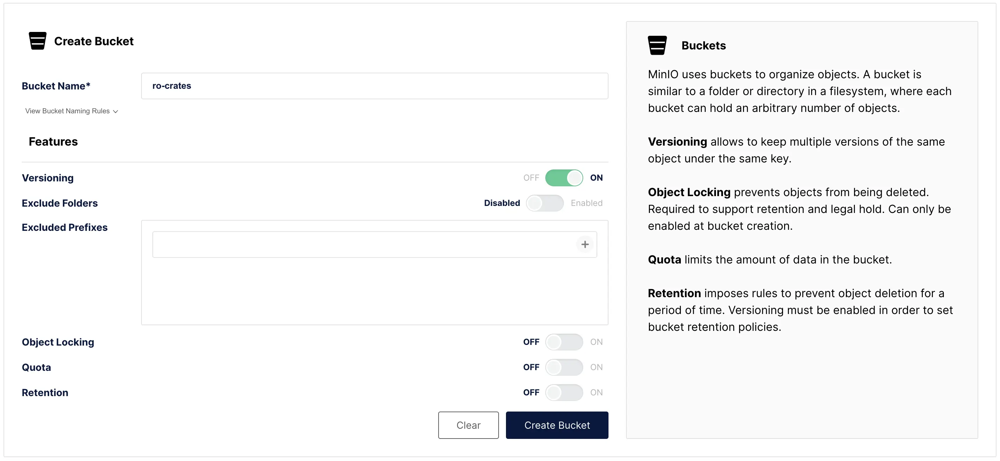
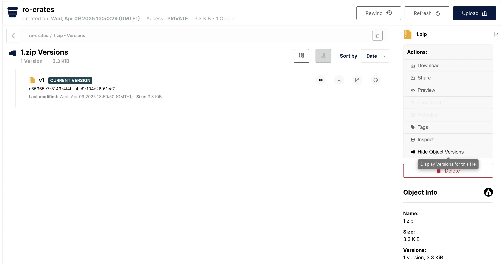

# RO-Crate Validation Service

This project presents a Flask-based API for validating RO-Crates.

## API

#### Request Validation of RO-Crate

<details>
 <summary><code>POST</code> <code><b>v1/ro_crates/{crate_id}/validation</b></code> <code>(Request validation of RO-Crate validation in Object Store)</code></summary>

##### Path Parameters

> | name       |  type     | data type               | description                                                           |
> |------------|-----------|-------------------------|-----------------------------------------------------------------------|
> | crate_id | required  | string                 | RO-Crate identifer string  |

##### Parameters

> | name       |  type     | data type               | description                                                           |
> |------------|-----------|-------------------------|-----------------------------------------------------------------------|
> | root_path | optional  | string                 | Root path which contains the RO-Crate  |
> | webhook_url | optional  | string                 | Webhook to send validation result to  |
> | minio_config | required  | dictionary                 | MinIO Configuration Details    |

`minio_config`
> | name       |  type     | data type               | description                                                           |
> |------------|-----------|-------------------------|-----------------------------------------------------------------------|
> | endpoint  | required  | string                 | MinIO endpoint  |
> | accesskey | required  | string                 | MinIO access key or username    |
> | secret | required  | string                 | MinIO secret or password    |
> | ssl | required  | boolean                 | Use SSL encryption for MinIO access?     |
> | bucket | required  | string                 | MinIO bucket containing RO-Crate    |

##### Responses

> | http code     | content-type                      | response                                                            |
> |---------------|-----------------------------------|---------------------------------------------------------------------|
> | `202`         | `application/json`                | `{"message": "Validation in progress"}`                             |
> | `400`         | `application/json`                | `{"message": "No RO-Crate with prefix: <crate_id>"}`                |
> | `500`         | `application/json`                | `{"message": "Internal server errors"}`                             |

> ```javascript
> curl -X 'POST' \
>  'http://localhost:5001/v1/ro_crates/<crate_id>/validation' \
>  -H 'accept: application/json' \
>  -H 'Content-Type: application/json' \
>  -d '{
>  "minio_config": {
>    "accesskey": "<key>",
>    "bucket": "ro-crates",
>    "endpoint": "minio:9000",
>    "secret": "<secret>",
>    "ssl": false
>  },
>  "profile_name": "<profile>",
>  "webhook_url": "<webhook>"
> }'
> ```


#### Get RO-Crate Validation Result

<details>
 <summary><code>GET</code> <code><b>v1/ro_crates/{crate_id}/validation</b></code> <code>(Obtain RO-Crate validation result from Object Store)</code></summary>

##### Path Parameters

> | name       |  type     | data type               | description                                                           |
> |------------|-----------|-------------------------|-----------------------------------------------------------------------|
> | crate_id | required  | string                 | RO-Crate identifer string  |

##### Parameters

> | name       |  type     | data type               | description                                                           |
> |------------|-----------|-------------------------|-----------------------------------------------------------------------|
> | root_path | optional  | string                 | Root path which contains the RO-Crate  |
> | minio_config | required  | dictionary                 | MinIO Configuration Details    |

`minio_config`
> | name       |  type     | data type               | description                                                           |
> |------------|-----------|-------------------------|-----------------------------------------------------------------------|
> | endpoint  | required  | string                 | MinIO endpoint  |
> | accesskey | required  | string                 | MinIO access key or username    |
> | secret | required  | string                 | MinIO secret or password    |
> | ssl | required  | boolean                 | Use SSL encryption for MinIO access?     |
> | bucket | required  | string                 | MinIO bucket containing RO-Crate    |

##### Responses

> | http code     | content-type                      | response                                                            |
> |---------------|-----------------------------------|---------------------------------------------------------------------|
> | `200`         | `application/json`                | `Successful Validation`                                             |
> | `422`         | `application/json`                | `Error: Details of Validation Error`                                |
> | `404`         | `application/json`                | `Not found`                                |

##### Example cURL

> ```javascript
>  curl -X 'GET' \
>  'http://localhost:5001/v1/ro_crates/<crate_id>/validation' \
>  -H 'accept: application/json' \
>  -H 'Content-Type: application/json' \
>  -d '{
>  "minio_config": {
>    "accesskey": "<key>",
>    "bucket": "ro-crates",
>    "endpoint": "minio:9000",
>    "secret": "<secret>",
>    "ssl": false
>  }
> }'
> ```

</details>

#### Validate RO-Crate Metadata

<details>
 <summary><code>POST</code> <code><b>v1/ro_crates/validate_metadata</b></code> <code>(validates submitted RO-Crate Metadata)</code></summary>

##### Parameters

> | name       |  type     | data type               | description                                                           |
> |------------|-----------|-------------------------|-----------------------------------------------------------------------|
> | crate_json | required  | string                 | RO-Crate metadata, stored as a single string  |
> | profile_name | optional  | string                 | RO-Crate profile to validate against  |


##### Responses

> | http code     | content-type                      | response                                                            |
> |---------------|-----------------------------------|---------------------------------------------------------------------|
> | `200`         | `application/json`                | `Successful Validation`                                             |
> | `422`         | `application/json`                | `Error: Details of Validation Error`                                |

##### Example cURL

> ```javascript
>  curl -X 'POST' \
>  'http://localhost:5001/v1/ro_crates/validate_metadata' \
>  -H 'accept: application/json' \
>  -H 'Content-Type: application/json' \
>  -d '{
>  "crate_json": "{'\''test1'\'':'\''test2'\''}"
> }'
> ```

</details>


## Project Structure

```
app/
├── ro_crates/
│   ├── routes/
│   │   ├── __init__.py         # Registers blueprints
│   │   └── post_routes.py      # POST API routes
│   └── __init__.py             
├── services/
│   ├── logging_service.py      # Centralised logging
│   └── validation_service.py   # Queue RO-Crates for validation
├── tasks/
│   └── validation_tasks.py     # Validate RO-Crates
├── utils/
│   ├── config.py               # Configuration
│   ├── minio_utils.py          # Methods for interacting with MinIO
│   └── webhook_utils.py        # Methods for sending webhooks
```

## Setting up the project

### Prerequisites

- Docker with Docker Compose

### Installation

1. Clone the repository:
    ```bash
   git clone https://github.com/eScienceLab/Cratey-Validator.git
   cd crate-validation-service
   ```

2. Create the `.env` file for shared environment information. An example environment file is included (`example.env`), which can be copied for this purpose. But make sure to change any security settings (username and passwords).

3. Build and start the services using Docker Compose:
    ```bash
   docker compose up --build
   ```

4. Set up the MinIO bucket
   1. Open the MinIO web interface at `http://localhost:9000`.  
   2. Log in with your MinIO credentials.  
   3. Create a new bucket named `ro-crates`.  
   4. **Enable versioning** for the `ro-crates` bucket — this is important for tracking unique object versions.

      

   5. Upload your RO-Crate files to the `ro-crates` bucket.  
   6. To verify that versioning is enabled:
      - Select the uploaded RO-Crate object in the `ro-crates` bucket.
      - Navigate to the **Actions** panel on the right.
      - The **Display Object Versions** option should be clickable.

      


## Development

For standard usage the Docker Compose script uses prebuilt containers.
For testing locally developed containers use the alternate Docker Compose file:
```bash
   docker compose --file docker-compose-develop.yml up --build
``` 

## Example Usage

Submission of validation of RO-Crate with the ID of `ro_crate_1`. No webhook is used here: 
```bash
curl -X 'POST' \
  'http://localhost:5001/ro_crates/v1/ro_crate_1/validation' \
  -H 'accept: application/json' \
  -H 'Content-Type: application/json' \
  -d '{}'
```

Retrieval of validation result for RO-Crate `ro_crate_1`:
```bash
curl -X 'GET' \
  'http://localhost:5001/ro_crates/v1/ro_crate_1/validation' \
  -H 'accept: application/json' \
  -H 'Content-Type: application/json' \
  -d '{}'
```
