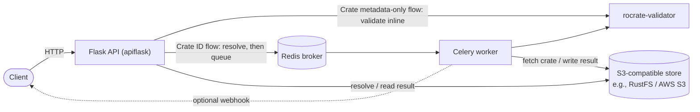
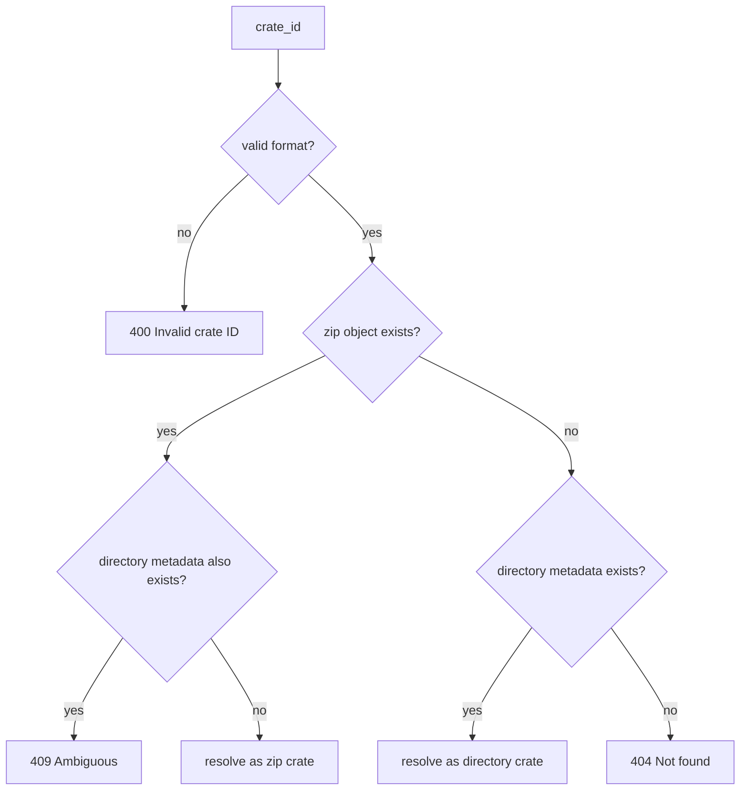
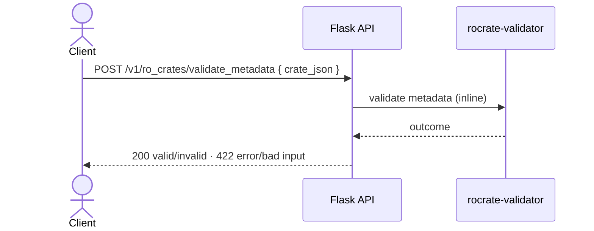
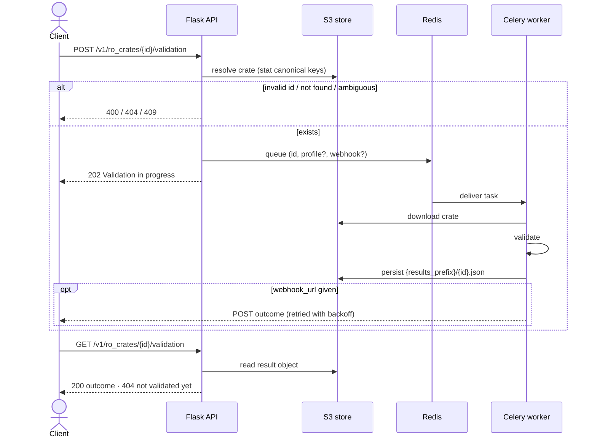

# RO-Crate Validation Service

A Flask + Celery service that validates [RO-Crates](https://www.researchobject.org/ro-crate/)
against RO-Crate profiles using the
[`rocrate-validator`](https://pypi.org/project/roc-validator/) library.

An **RO-Crate** is a way of packaging research data together with structured,
machine-readable metadata (a JSON-LD file named `ro-crate-metadata.json`).
**Validating** a crate checks that metadata against a **profile** (a set of
requirements, e.g. the base `ro-crate` profile or a domain profile such as
`five-safes-crate`) and reports whether it conforms.

The service works in two modes:

- **Metadata-only (default):** validate an RO-Crate metadata document supplied
  directly in the request. This is stateless, so nothing is stored.
- **Storage-backed (optional):** validate whole crates (zip or directory) held
  in an S3-compatible object store, asynchronously, and store the results.

## Architecture


```mermaid
flowchart LR
    Client([Client])
    API["Flask API (apiflask)"]
    Worker["Celery worker"]
    Broker[("Redis broker")]
    Validator["rocrate-validator"]
    Store[("S3-compatible store<br/>e.g., RustFS / AWS S3")]

    Client -->|HTTP| API
    API -->|"Crate metadata-only flow: validate inline"| Validator
    API -->|"Crate ID flow: resolve, then queue"| Broker
    Broker --> Worker
    Worker --> Validator
    API -->|"resolve / read result"| Store
    Worker -->|"fetch crate / write result"| Store
    Worker -.->|"optional webhook"| Client
```

- **Flask API** handles HTTP. Metadata-only validation runs **inline** (stateless). 
  S3-backed requests are validated by the **Celery worker**.
- **Redis** is the Celery broker.
- **S3-compatible store** holds crates and validation results. Credentials live
  **server-side** (the service is configured with them); clients never send
  storage credentials. Any S3-compatible store should work — the dev stack uses
  [RustFS](https://rustfs.com/).

## Concepts

### Crate ID

In the S3 flow, a crate is addressed by a **Crate ID**. This a short,
opaque label chosen by the caller (e.g. `my-dataset-2026`). It is **not** a
filename, a path, or a URL: the service composes the actual object keys from it.

Crate IDs are validated strictly: they must match
`^[A-Za-z0-9][A-Za-z0-9._-]{0,127}$` (start alphanumeric; only letters, digits,
`.`, `_`, `-`; max 128 characters; no `/` or `..`). This:

- keeps IDs safe to compose into object keys and local paths;
- means the ID is treated as a single opaque token — a `.zip` **inside** an ID is
  harmless, because the service never parses meaning out of the ID.

Invalid IDs are rejected with `400` before anything else happens.

### Storage layout

Crates and their results live under separate, configurable prefixes in one
bucket, so a result can never be confused with (or collide with) a crate:

| Item | Object key |
|------|------------|
| Crate (zip) | `{S3_CRATE_PREFIX}/{id}.zip` |
| Crate (directory) | `{S3_CRATE_PREFIX}/{id}/` containing `ro-crate-metadata.json` |
| Validation result | `{S3_RESULTS_PREFIX}/{id}.json` |

Defaults: `S3_CRATE_PREFIX=crates`, `S3_RESULTS_PREFIX=validation-results`.

> **Zip layout matters:** for a zip crate, `ro-crate-metadata.json` must be at
> the **root** of the archive. Zipping a folder (so entries look like
> `mycrate/ro-crate-metadata.json`) makes the crate invalid. Zip the crate's
> **contents**, not its containing folder.

### Crate resolution

The service resolves a Crate ID to a concrete object by **direct existence
checks on the canonical keys**, rather than by listing a prefix and assuming. This
makes resolution deterministic and unambiguous:

Where the **zip object** is `{prefix}/{id}.zip` and the **directory metadata** is
`{prefix}/{id}/ro-crate-metadata.json`:


```mermaid
flowchart TD
    A["crate_id"] --> B{"valid format?"}
    B -- no --> E["400 Invalid crate ID"]
    B -- yes --> C{"zip object exists?"}
    C -- yes --> Z{"directory metadata also exists?"}
    Z -- yes --> AMB["409 Ambiguous"]
    Z -- no --> ZIP["resolve as zip crate"]
    C -- no --> D{"directory metadata exists?"}
    D -- yes --> DIR["resolve as directory crate"]
    D -- no --> NF["404 Not found"]
```

### Validation outcome

Every validation produces a single **outcome** object with an explicit status:

| status | meaning |
|--------|---------|
| `valid` | the crate/metadata conforms to the profile |
| `invalid` | it was validated but has conformance issues (see `detail`) |
| `error` | it could not be validated (bad input, validator failure) |

```json
{ "status": "invalid", "profile": "ro-crate-1.2", "created_at": "…", "detail": { … } }
```

## Request flows

### Metadata-only (synchronous)


```mermaid
sequenceDiagram
    actor Client
    participant API as Flask API
    participant V as rocrate-validator
    Client->>API: POST /v1/ro_crates/validate_metadata { crate_json }
    API->>V: validate metadata (inline)
    V-->>API: outcome
    API-->>Client: 200 valid/invalid · 422 error/bad input
```

### S3-backed (asynchronous)


```mermaid
sequenceDiagram
    actor Client
    participant API as Flask API
    participant S as S3 store
    participant Q as Redis
    participant W as Celery worker
    Client->>API: POST /v1/ro_crates/{id}/validation
    API->>S: resolve crate (stat canonical keys)
    alt invalid id / not found / ambiguous
        API-->>Client: 400 / 404 / 409
    else exists
        API->>Q: queue (id, profile?, webhook?)
        API-->>Client: 202 Validation in progress
        Q->>W: deliver task
        W->>S: download crate
        W->>W: validate
        W->>S: persist {results_prefix}/{id}.json
        opt webhook_url given
            W-->>Client: POST outcome (retried with backoff)
        end
    end
    Client->>API: GET /v1/ro_crates/{id}/validation
    API->>S: read result object
    API-->>Client: 200 outcome · 404 not validated yet
```

The worker runs the stages in order (**fetch → validate → persist → webhook**), so
a storage write failure can never trigger a "success" webhook, and the outcome
(including an `error` outcome) is always persisted so `GET` reflects it.

## API

Base URL in the dev stack: `http://localhost:5001`.

### `POST /v1/ro_crates/validate_metadata`

Validate an RO-Crate metadata document inline. This is always available.

| field | required | type | description |
|-------|----------|------|-------------|
| `crate_json` | yes | string | RO-Crate metadata JSON-LD, as a string |
| `profile_name` | no | string | profile to validate against (default: auto/base profile) |

Responses: `200` (valid/invalid outcome), `422` (missing/empty/invalid JSON, or
an `error` outcome).

`crate_json` is the metadata document as a **string**, so the easiest way to
validate a file is to let `jq` read and escape it (`-R` raw, `-s` slurp), and then
post the result:

```bash
jq -Rs '{crate_json: .}' ro-crate-metadata.json \
  | curl -X POST http://localhost:5001/v1/ro_crates/validate_metadata \
      -H 'Content-Type: application/json' -d @-
```

Add a profile with `jq -Rs '{crate_json: ., profile_name: "ro-crate-1.2"}' …`.

Or inline a small document directly:

```bash
curl -X POST http://localhost:5001/v1/ro_crates/validate_metadata \
  -H 'Content-Type: application/json' \
  -d '{"crate_json": "{\"@context\": \"https://w3id.org/ro/crate/1.2/context\", \"@graph\": []}"}'
```

### `POST /v1/ro_crates/{crate_id}/validation`

Queue a stored crate for validation. **This is only registered when storage is enabled** 
(otherwise `404`). The request body carries no credentials.

| field | required | type | description |
|-------|----------|------|-------------|
| `profile_name` | no | string | profile to validate against |
| `webhook_url` | no | string | URL to POST the result to when done |

Responses: `202` queued, `400` invalid ID, `404` crate not found, `409` 
ambiguous (both zip and directory exist) in the object store, `503` storage unavailable.

```bash
curl -X POST http://localhost:5001/v1/ro_crates/my-crate/validation \
  -H 'Content-Type: application/json' -d '{"profile_name": "ro-crate-1.2"}'
```

### `GET /v1/ro_crates/{crate_id}/validation`

Fetch a stored validation result. Only registered when storage is enabled.

Responses: `200` (the stored outcome, including a persisted `error` outcome), 
`400` invalid ID, `404` no result stored yet.

```bash
curl http://localhost:5001/v1/ro_crates/my-crate/validation
```

### Health

- `GET /healthz` - liveness; `200 {"status": "ok"}` whenever the process is up.
- `GET /readyz` - readiness; checks the object store and Celery broker. `200`
  when ready/available, `503` otherwise. When storage is disabled, those dependencies 
  report `disabled`.

## Configuration

Configuration is read once at the start and validated; a misconfigured deployment
fails quickly with a clear error rather than at the first request.

| config | default | description |
|----------|---------|-------------|
| `STORAGE_ENABLED` | `false` | enable the S3 ID endpoints |
| `S3_ENDPOINT` | — | object store endpoint, e.g. `objectstore:9000` |
| `S3_ACCESS_KEY` | — | access key |
| `S3_SECRET_KEY` | — | secret key |
| `S3_BUCKET` | — | bucket holding crates and results |
| `S3_USE_SSL` | `false` | use HTTPS to the store |
| `S3_REGION` | `us-east-1` | region (for AWS; not used elsewhere) |
| `S3_CRATE_PREFIX` | `crates` | key prefix for crates |
| `S3_RESULTS_PREFIX` | `validation-results` | key prefix for results |
| `CELERY_BROKER_URL` | — | Redis broker URL |
| `CELERY_RESULT_BACKEND` | — | Celery result backend URL |
| `PROFILES_PATH` | — | directory of profiles that **replaces** the bundled set (optional) |
| `EXTRA_PROFILES_PATH` | — | directory of profiles **added** to the bundled set (optional) |
| `CACHE_PATH` | per-user dir | HTTP cache location for the validator |
| `VALIDATION_OFFLINE` | `false` | validate using only the cache (no network) |
| `FLASK_ENV` | `development` | `production` disables debug |

When `STORAGE_ENABLED=true`, the `S3_*` and `CELERY_*` variables above are
**required** — startup fails if any are missing.

### Profiles, cache, and offline validation

Custom profiles (e.g. `five-safes-crate`) are best added with
`EXTRA_PROFILES_PATH`, which **adds** them to the validator's bundled profiles —
unlike `PROFILES_PATH`, which replaces the bundled set entirely. The published
"with profiles" image bakes the five-safes profile in this way.

The validator caches the profile/context HTTP resources it fetches. The Docker
image pre-populates this cache at build time (`rocrate-validator cache warm`),
so setting `VALIDATION_OFFLINE=true` runs validation entirely from the cache
with no network access. Online validation (the default) also uses and refreshes
the cache. (Requires rocrate-validator ≥ 0.10.0.)

## Running the service

### Prerequisites

- Docker with Docker Compose

### Quick start

```bash
git clone https://github.com/eScienceLab/RO-Crate-Validation-Service.git
cd RO-Crate-Validation-Service
cp example.env .env          # and then edit credentials
docker compose up --build
```

This runs in **metadata-only** mode (no storage). The API is at
`http://localhost:5001`.

### With object storage (RustFS)

Set `STORAGE_ENABLED=true` in `.env`, then start the local object store with its
opt-in profile (uses the prebuilt image compose file, or `-f
docker-compose-develop.yml` to build locally):

```bash
docker compose --profile objectstore up --build
```

The RustFS console is at `http://localhost:9001` (default credentials are 
`rustfsadmin` / `rustfsadmin`). Create the bucket named in `S3_BUCKET`
(default `ro-crates`) and upload crates under the crate prefix
(`crates/<id>.zip` or `crates/<id>/…`).

> The service does not create the bucket; create it once via the console, the RustFS
> Web UI, AWS CLI, or `boto3`.

### Custom profiles

To validate against profiles other than the bundled ones, mount a profiles
directory into **both** the flask and worker containers (metadata validation
runs in flask; crate validation runs in the worker) and set `PROFILES_PATH` to
the mounted path. See `docker-compose-develop.yml` for a working example.

## Development

```bash
docker compose -f docker-compose-develop.yml --profile objectstore up --build
```

### Dependencies

Direct dependencies live in `pyproject.toml`. 

```bash
pip-compile pyproject.toml -o requirements.txt                   # runtime lock
pip-compile --extra dev pyproject.toml -o requirements-dev.txt   # + dev tools
```

### Tests & linting

```bash
pip install -r requirements-dev.txt
pytest --ignore=tests/test_integration.py     # unit tests (no Docker needed)
pytest tests/test_integration.py              # integration tests (needs Docker)
ruff check . && ruff format --check .         # lint + format
```

`tests/` mirrors the `app/` package layout. The integration tests bring up the
compose stack and seed crates via `boto3`.

## Project structure

```
app/
├── __init__.py                 # app factory: config, blueprints, error handlers, request IDs
├── health.py                   # /healthz and /readyz
├── storage/                    # object-storage abstraction
│   ├── base.py                 #   StorageBackend protocol + ObjectStat
│   ├── s3.py                   #   boto3 implementation (any S3-compatible store)
│   ├── memory.py               #   in-memory backend (tests / local)
│   └── errors.py               #   StorageError, ObjectNotFound
├── crates/                     # crate identity, layout, resolution
│   ├── ids.py                  #   'Crate ID' validation
│   ├── layout.py               #   object keys
│   └── resolver.py             #   deterministic zip/dir resolution
├── validation/                 # validation boundary
│   ├── results.py              #   ValidationOutcome (valid/invalid/error)
│   └── runner.py               #   wraps rocrate-validator
├── ro_crates/routes/           #   HTTP endpoints (metadata + ID-based)
├── services/
│   ├── validation_service.py   #   request handling: resolve, queue, read results
│   └── logging_service.py      #   JSON logging, request IDs, redaction
├── tasks/validation_tasks.py   #   Celery task: fetch → validate → persist → webhook
└── utils/
    ├── config.py               #   validated Settings
    └── webhook_utils.py        #   webhook delivery with retry/backoff
```

## License

MIT — © eScience Lab, The University of Manchester.
