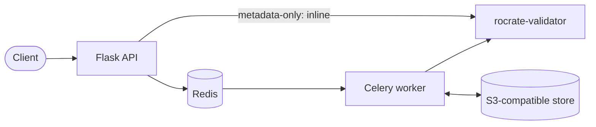

# Development and Contributions

The [RO-Crate Validation Service](https://github.com/eScienceLab/RO-Crate-Validation-Service) is an open source project and welcomes contributions of all kinds: bug reports, code or documentation changes, and reviews of proposed changes. The underlying [rocrate-validator tool](https://github.com/crs4/rocrate-validator) is also open source, and is a separate project maintained by CRS4. 

This service is written with Python 3.11, built on Flask/APIFlask and Celery, and wraps the [`rocrate-validator`](https://rocrate-validator.readthedocs.io/) in a REST API. The RO-Crate Validation Service enables pipelines, other services, and Trusted Research Environments (TREs) to validate an RO-Crate over HTTP without running the validator themselves.

## Contributing

The easiest way to start contributing is to create an issue, either to let us know of a bug or error, or to propose a piece of work you want to do. For the RO-Crate Validation Service (the API service, Docker image, and Compose stack) use the [RO-Crate Validation Service issues](https://github.com/eScienceLab/RO-Crate-Validation-Service/issues) page. Issues with the validation checks themselves belong to the underlying tool rather than this service: report those on the [rocrate-validator issues](https://github.com/crs4/rocrate-validator/issues) page, and follow that project's own contribution guidance.

### Code contributions

If you want to contribute code changes via GitHub then you may want to read ['How to Contribute to an Open Source Project on GitHub'](https://egghead.io/courses/how-to-contribute-to-an-open-source-project-on-github). We use [GitHub flow](https://docs.github.com/en/get-started/using-github/github-flow) to manage changes:

1. Create a new branch in your local clone of this repository for each significant change.
2. Commit the change in that branch.
3. Push that branch to your fork of this repository on GitHub.
4. Submit a pull request from that branch to the [upstream repository](https://github.com/eScienceLab/RO-Crate-Validation-Service).
5. If you receive feedback, make the changes in your local clone and push to your branch on GitHub: the pull request will update automatically.

!!! warning
    Note that we use the `develop` branch for development work, and this is where your PR should be aimed. The `main` branch is used for releases, and only pull requests from the `develop` branch are accepted to this.

## Development stack

The development Compose file builds the image from the local `Dockerfile` and mounts the repository's test profiles into both the API and worker containers:

```bash
docker compose -f docker-compose-develop.yml up --build
```

Here `--build` matters: without it, Compose reuses the previously built image and local code changes are not picked up. Add `--profile objectstore` to start the bundled RustFS store for storage-backed work; configuration is the same as in [Installation & Setup](installation.md#configuration-reference).

## Tests

Install the development dependencies, then run the unit tests, which do not use Docker Engine:

```bash
pip install -r requirements-dev.txt
```

```bash
pytest --ignore=tests/test_integration.py
```

The integration tests bring up the full Compose stack (including the object store) and seed crates with `boto3`, for which they need Docker Engine to be running:

```bash
pytest tests/test_integration.py
```

`tests/` mirrors the layout of the `app/` package, so the tests for a module are in the matching directory.

## Linting

The project uses [Ruff](https://docs.astral.sh/ruff/) for linting and formatting, configured in `pyproject.toml`:

```bash
ruff check . && ruff format --check .
```

## Dependencies

Direct dependencies are declared in `pyproject.toml`; while the `requirements*.txt` files are locks generated using `pip-compile`:

```bash
pip-compile pyproject.toml -o requirements.txt
```

```bash
pip-compile --extra dev pyproject.toml -o requirements-dev.txt
```

## Continuous Integration

Pull requests to `develop` will trigger three workflows: unit tests, integration tests (which start the Compose stack), and lint (`ruff check` and `ruff format --check`).

## How the API works

The API server handles HTTP and runs metadata-only validation inline. Object storage-backed validation is queued through Redis to a Celery worker, which reads the crate from the S3-compatible store, validates it, and writes the result back:



The worker runs its stages strictly in order: fetch, validate, persist, webhook; so a storage write failure can never be followed by a success notification, and every outcome (including `error` outcomes) is persisted so a later `GET` reflects what happened.

## Project structure

```
app/
├── __init__.py                 # app factory: config, blueprints, error handlers, request IDs
├── health.py                   # /healthz and /readyz
├── storage/                    # object-storage abstraction
│   ├── base.py                 #   StorageBackend protocol
│   ├── s3.py                   #   boto3 implementation (any S3-compatible store)
│   ├── memory.py               #   in-memory backend (tests / local)
│   └── errors.py               #   StorageError, ObjectNotFound
├── crates/                     # crate identity, layout, resolution
│   ├── ids.py                  #   Crate ID validation
│   ├── layout.py               #   object keys
│   └── resolver.py             #   deterministic zip/directory resolution
├── validation/                 # validation boundary
│   ├── results.py              #   ValidationOutcome (valid/invalid/error)
│   └── runner.py               #   wraps rocrate-validator
├── ro_crates/routes/           # HTTP endpoints (metadata + ID-based)
├── services/                   # request handling and logging
├── tasks/validation_tasks.py   # Celery task: fetch, validate, persist, webhook
└── utils/                      # validated settings, webhook delivery
```
