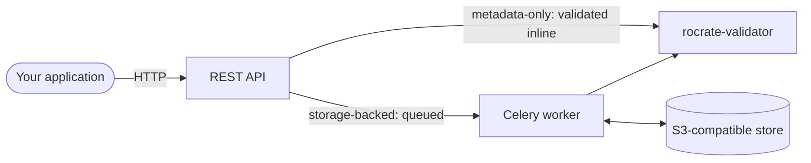

# RO-Crate Validation Service

The RO-Crate Validation Service evaluates whether [RO-Crates](https://www.researchobject.org/ro-crate/) conform to the RO-Crate specification and to community profiles. The service wraps the [`rocrate-validator`](https://rocrate-validator.readthedocs.io/) library in a REST API, and is deployed as a Docker image. The RO-Crate Validation Service enables pipelines, other services, and Trusted Research Environments (TREs) to validate an RO-Crate over HTTP without running the validator themselves.

## RO-Crates and profiles in brief

An [RO-Crate](https://www.researchobject.org/ro-crate/) packages research data together with structured, machine-readable metadata: a JSON-LD file named `ro-crate-metadata.json`. Validating an RO-Crate evaluates that metadata against a **profile**. A profile is a set of requirements the RO-Crate must satisfy. That can be the base requirements of the [RO-Crate specification](https://www.researchobject.org/ro-crate/1.2/) itself, or a [community profile](https://www.researchobject.org/ro-crate/profiles) that adds domain-specific rules, such as the [Five Safes RO-Crate profile](https://trefx.uk/5s-crate/) for working with sensitive data in TREs.

Whilst the validation checks themselves are performed by [`rocrate-validator`](https://rocrate-validator.readthedocs.io/), this service is a deployable HTTP wrapper around that tool: it adds a web API, asynchronous processing, and object-storage integration. The base validation rules come from the validator itself; we additionally package our own [Five Safes RO-Crate profile](five-safes.md) rules with the service for working in TREs.

## Validation methods

1. **Metadata-only**. Send the contents of an `ro-crate-metadata.json` file and receive the validation result in the response. This is synchronous and stateless, so nothing is stored, and no object store or worker is required. This approach is simpler to use, and is intended for quick evaluations whilst metadata is being written, or before a full crate has been assembled.

2. **Storage-backed**. The service reads complete RO-Crates (zip or directory) from an S3-compatible object store, such as RustFS, AWS S3, MinIO, and others. Validation runs asynchronously on a worker process; the result is stored for later retrieval and can optionally be delivered to a webhook. This is more suited to pipelines and workflows.

## Documentation

- To run the service yourself, start with [Installation & Setup](installation.md), or with the [Upgrade Guide](upgrading.md) if you already run a 1.x version. 
- The [API Reference](api.md) documents the endpoints for anyone integrating against a running instance. 
- The [Five Safes RO-Crate](five-safes.md) page walks through validating RO-Crates in a TRE. 
- To help contribute to the service, please see the [Contribution Guide](contribution.md).

## About

The RO-Crate Validation Service is developed by the [eScience Lab](https://esciencelab.org.uk/) at The University of Manchester, and available on [GitHub](https://github.com/eScienceLab/RO-Crate-Validation-Service) under the MIT licence.
